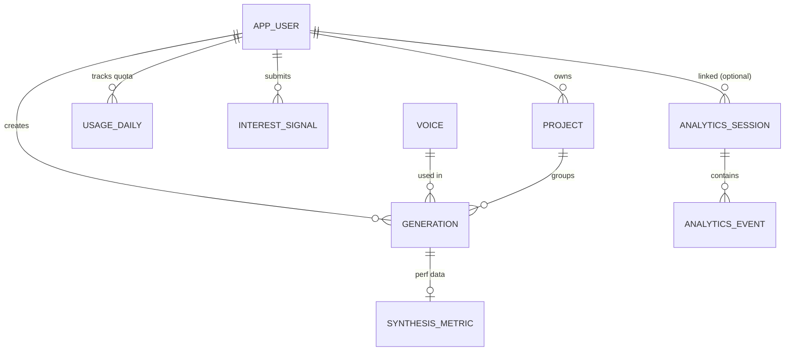

# Database Blueprint — PostgreSQL

## Technology & Configuration

| Parameter        | Value                                                |
| ---------------- | ---------------------------------------------------- |
| RDBMS            | PostgreSQL                                           |
| Local Connection | `jdbc:postgresql://localhost:5432/postgres`           |
| Prod Connection  | `${DATABASE_URL}` (Neon serverless PostgreSQL)       |
| Local Credentials| `postgres` / `0000`                                  |
| Schema Init Mode | `spring.sql.init.mode: always`                       |
| Schema File      | `backend/src/main/resources/schema.sql` (124 lines)  |
| Seed Data File   | `backend/src/main/resources/data.sql` (13 lines)     |
| Access Layer     | `JdbcTemplate` (raw SQL) — **no JPA, no Hibernate**  |
| Connection Pool  | HikariCP (prod: max 5, min idle 2, idle-timeout 10m, max-lifetime 30m) |

---

## Schema Initialization

Both `schema.sql` and `data.sql` execute on every Spring Boot startup (`init.mode: always`). All DDL uses `CREATE TABLE IF NOT EXISTS` and `ADD COLUMN IF NOT EXISTS` for idempotency. Seed data uses `ON CONFLICT ... DO NOTHING`.

---

## Entity-Relationship Diagram



---

## Tables (11 Total)

### 1. `app_user` — Registered Users

| Column          | Type          | Constraints                 | Default        | Description                      |
| --------------- | ------------- | --------------------------- | -------------- | -------------------------------- |
| `id`            | `BIGSERIAL`   | `PRIMARY KEY`               | auto-increment | Unique user ID                   |
| `email`         | `VARCHAR(255)`| `NOT NULL UNIQUE`           | —              | Login email                      |
| `password_hash` | `VARCHAR(255)`| `NOT NULL`                  | —              | BCrypt hash                      |
| `display_name`  | `VARCHAR(100)`| `NOT NULL`                  | —              | User's display name              |
| `is_admin`      | `BOOLEAN`     | `NOT NULL`                  | `FALSE`        | Admin role flag                  |
| `created_at`    | `TIMESTAMPTZ` | `NOT NULL`                  | `now()`        | Registration timestamp           |

**Cascade Behavior**: Deleting a user cascades to `project`, `generation`, `usage_daily` (ON DELETE CASCADE). `interest_signal` and `analytics_session` set `user_id` to NULL.

**Queried By**: `AppUserRepository.findByEmail()`, `AppUserRepository.findById()`, `AdminController.recentUsers()`, `SiteMetricsController`.

---

### 2. `voice` — TTS Voice Presets

| Column            | Type          | Constraints                 | Default | Description                           |
| ----------------- | ------------- | --------------------------- | ------- | ------------------------------------- |
| `id`              | `BIGSERIAL`   | `PRIMARY KEY`               | auto    | Internal voice ID                     |
| `engine_voice_id` | `VARCHAR(20)` | `NOT NULL UNIQUE`           | —       | Engine key (`M1`–`M5`, `F1`–`F5`)    |
| `display_name`    | `VARCHAR(50)` | `NOT NULL`                  | —       | Human-readable name (e.g. "Rohan")   |
| `gender`          | `VARCHAR(10)` | `NOT NULL`                  | —       | `"male"` or `"female"`               |
| `style_tag`       | `VARCHAR(30)` | `NOT NULL`                  | —       | Voice style (e.g. "Calm", "Dynamic") |
| `is_available`    | `BOOLEAN`     | `NOT NULL`                  | `TRUE`  | Soft-delete flag for disabling voices |

**Seed Data** (`data.sql`): 10 voices inserted on startup:

| engine_voice_id | display_name | gender | style_tag    |
| --------------- | ------------ | ------ | ------------ |
| M1              | Rohan        | male   | Calm         |
| M2              | Aryan        | male   | Dynamic      |
| M3              | Kabir        | male   | Steady       |
| M4              | Dev          | male   | Warm         |
| M5              | Vihaan       | male   | High Energy  |
| F1              | Isha         | female | Warm         |
| F2              | Meera        | female | Calm         |
| F3              | Priya        | female | Dynamic      |
| F4              | Kavya        | female | High Energy  |
| F5              | Naina        | female | Steady       |

**Queried By**: `VoiceController`, `TtsController.getVoices()`, `TtsGenerationService.resolveVoiceDbId()`, `AdminController.topVoices()`.

---

### 3. `project` — User Folders/Projects

| Column       | Type          | Constraints                                         | Default | Description         |
| ------------ | ------------- | --------------------------------------------------- | ------- | ------------------- |
| `id`         | `BIGSERIAL`   | `PRIMARY KEY`                                       | auto    | Project ID          |
| `user_id`    | `BIGINT`      | `NOT NULL REFERENCES app_user(id) ON DELETE CASCADE` | —       | Owner               |
| `name`       | `VARCHAR(100)`| `NOT NULL`                                          | —       | Project name        |
| `created_at` | `TIMESTAMPTZ` | `NOT NULL`                                          | `now()` | Creation timestamp  |

**Cascade Behavior**: Deleting a user cascades to delete all their projects. Deleting a project sets `generation.project_id` to NULL (ON DELETE SET NULL on generation FK).

**Queried By**: `DashboardRepository.getProjects()`, `ProjectService`.

---

### 4. `generation` — TTS Generation Records

| Column             | Type           | Constraints                                          | Default       | Description                           |
| ------------------ | -------------- | ---------------------------------------------------- | ------------- | ------------------------------------- |
| `id`               | `BIGSERIAL`    | `PRIMARY KEY`                                        | auto          | Generation ID                         |
| `user_id`          | `BIGINT`       | `REFERENCES app_user(id) ON DELETE CASCADE`          | —             | Owner (NULL for anonymous previews)   |
| `project_id`       | `BIGINT`       | `REFERENCES project(id) ON DELETE SET NULL`          | —             | Associated project (optional)         |
| `voice_id`         | `BIGINT`       | `NOT NULL REFERENCES voice(id)`                      | —             | Voice used                            |
| `input_text`       | `TEXT`         | `NOT NULL`                                           | —             | Source text that was synthesized      |
| `char_count`       | `INT`          | `NOT NULL`                                           | —             | Character count of input              |
| `audio_path`       | `VARCHAR(500)` | —                                                    | NULL          | File path to saved WAV               |
| `duration_seconds` | `NUMERIC(6,2)` | —                                                    | NULL          | Audio duration in seconds             |
| `status`           | `VARCHAR(20)`  | `NOT NULL`                                           | `'pending'`   | `pending` → `success` / `failed`     |
| `is_liked`         | `BOOLEAN`      | `NOT NULL`                                           | `FALSE`       | User's favourite flag                 |
| `stage`            | `VARCHAR(50)`  | —                                                    | `'completed'` | Processing stage indicator            |
| `estimated_seconds`| `INT`          | —                                                    | NULL          | Estimated generation time             |
| `synthesis_ms`     | `BIGINT`       | —                                                    | NULL          | Actual synthesis time in milliseconds |
| `created_at`       | `TIMESTAMPTZ`  | `NOT NULL`                                           | `now()`       | Creation timestamp                    |

**Index**: `idx_generation_status` on `(status, created_at)` — optimizes admin stats queries.

**Lifecycle**:
1. Insert with `status = 'pending'` (`DashboardRepository.createGeneration()`).
2. On success → update to `status = 'success'`, set `audio_path`, `duration_seconds` (`updateGenerationSuccess()`).
3. On failure → update to `status = 'failed'` (`updateGenerationFailed()`).

**Queried By**: `DashboardRepository.getGenerations()`, `GenerationController`, `HistoryController`, `AdminController.stats()`, `SiteMetricsController`.

---

### 5. `usage_daily` — Daily Character Quota Tracking

| Column           | Type      | Constraints                                         | Default | Description                       |
| ---------------- | --------- | --------------------------------------------------- | ------- | --------------------------------- |
| `id`             | `BIGSERIAL`| `PRIMARY KEY`                                      | auto    |                                   |
| `user_id`        | `BIGINT`  | `NOT NULL REFERENCES app_user(id) ON DELETE CASCADE` | —       | User being tracked                |
| `usage_date`     | `DATE`    | `NOT NULL`                                          | —       | Calendar date                     |
| `characters_used`| `INT`     | `NOT NULL`                                          | `0`     | Chars synthesized today           |
| `generation_count`| `INT`    | `NOT NULL`                                          | `0`     | Number of generations today       |

**Unique Constraint**: `(user_id, usage_date)` — one row per user per day.

**Upsert Pattern**: `INSERT ... ON CONFLICT (user_id, usage_date) DO UPDATE SET characters_used = usage_daily.characters_used + EXCLUDED.characters_used, generation_count = usage_daily.generation_count + 1` — atomic increment.

**Business Rule**: `TtsGenerationService` checks `characters_used` against `app.usage.daily-limit` (5000) before allowing generation. Exceeding throws `DailyLimitExceededException` (429).

**Queried By**: `DashboardRepository.getUsageToday()`, `DashboardRepository.upsertUsage()`, `UsageController`.

---

### 6. `contact_message` — Contact Form Submissions

| Column       | Type           | Constraints    | Default | Description         |
| ------------ | -------------- | -------------- | ------- | ------------------- |
| `id`         | `BIGSERIAL`    | `PRIMARY KEY`  | auto    |                     |
| `name`       | `VARCHAR(100)` | `NOT NULL`     | —       | Sender name         |
| `email`      | `VARCHAR(255)` | `NOT NULL`     | —       | Sender email        |
| `message`    | `TEXT`         | `NOT NULL`     | —       | Message body        |
| `created_at` | `TIMESTAMPTZ`  | `NOT NULL`     | `now()` | Submission time     |

**Rate Limited**: 5 submissions per IP per hour (enforced by `RateLimitService`).

**Queried By**: `ContactController.submit()`, `AdminController.contacts()`, `SiteMetricsController`.

---

### 7. `interest_signal` — Monetisation Interest Data

| Column              | Type          | Constraints                                        | Default | Description                         |
| ------------------- | ------------- | -------------------------------------------------- | ------- | ----------------------------------- |
| `id`                | `BIGSERIAL`   | `PRIMARY KEY`                                      | auto    |                                     |
| `user_id`           | `BIGINT`      | `REFERENCES app_user(id) ON DELETE SET NULL`        | —       | Submitter (NULL if user deleted)    |
| `would_pay`         | `VARCHAR(10)` | `NOT NULL`                                         | —       | `"yes"`, `"no"`, or `"maybe"`      |
| `suggested_price_inr`| `INT`        | —                                                  | NULL    | User-suggested price in INR         |
| `comment`           | `TEXT`        | —                                                  | NULL    | Free-text feedback                  |
| `created_at`        | `TIMESTAMPTZ` | `NOT NULL`                                         | `now()` | Submission time                     |

**Purpose**: Collects willingness-to-pay signals from authenticated users to inform pricing decisions.

**Queried By**: `InterestController.submitInterest()`, `AdminController.stats()` (aggregated breakdown).

---

### 8. `analytics_session` — Visitor Sessions

| Column        | Type           | Constraints                                        | Default | Description                           |
| ------------- | -------------- | -------------------------------------------------- | ------- | ------------------------------------- |
| `id`          | `BIGSERIAL`    | `PRIMARY KEY`                                      | auto    |                                       |
| `session_id`  | `VARCHAR(100)` | `NOT NULL UNIQUE`                                  | —       | UUID generated per browser tab        |
| `anonymous_id`| `VARCHAR(100)` | `NOT NULL`                                         | —       | Persistent UUID per browser (localStorage) |
| `user_id`     | `BIGINT`       | `REFERENCES app_user(id) ON DELETE SET NULL`        | NULL    | Linked if user logs in during session |
| `ip_hash`     | `VARCHAR(64)`  | —                                                  | NULL    | SHA-256 of IP + salt (privacy)        |
| `device_type` | `VARCHAR(20)`  | —                                                  | NULL    | `"mobile"`, `"tablet"`, `"desktop"`   |
| `browser`     | `VARCHAR(50)`  | —                                                  | NULL    | Browser name (e.g. `"Chrome"`)        |
| `referrer`    | `VARCHAR(500)` | —                                                  | NULL    | HTTP referrer URL                     |
| `created_at`  | `TIMESTAMPTZ`  | `NOT NULL`                                         | `now()` | Session start time                    |

**Indexes**:
- `idx_analytics_session_created` on `(created_at)`.
- `idx_analytics_session_anon` on `(anonymous_id)`.

**Insert Pattern**: `INSERT ... ON CONFLICT DO NOTHING` (idempotent — sessions are created once, then updated if user logs in during the session).

**Queried By**: `AnalyticsController.trackEvents()`, `AdminController.analyticsSummary()`, `PublicStatsController.publicStats()`, `SiteMetricsController`.

---

### 9. `analytics_event` — Granular Event Log

| Column       | Type           | Constraints                                                      | Default | Description                         |
| ------------ | -------------- | ---------------------------------------------------------------- | ------- | ----------------------------------- |
| `id`         | `BIGSERIAL`    | `PRIMARY KEY`                                                    | auto    |                                     |
| `session_id` | `VARCHAR(100)` | `NOT NULL REFERENCES analytics_session(session_id) ON DELETE CASCADE` | —  | Parent session                      |
| `event_name` | `VARCHAR(100)` | `NOT NULL`                                                       | —       | Event type (e.g. `page_view`, `generate_click`, `session_start`) |
| `route`      | `VARCHAR(255)` | —                                                                | NULL    | Angular route at time of event      |
| `properties` | `JSONB`        | —                                                                | NULL    | Arbitrary event properties          |
| `created_at` | `TIMESTAMPTZ`  | `NOT NULL`                                                       | `now()` | Event timestamp                     |

**Indexes**:
- `idx_analytics_event_name` on `(event_name)` — fast filtering by event type.
- `idx_analytics_event_created_at` on `(created_at)` — time-range queries for admin dashboard.

**JSONB `properties` Examples**:
```json
// session_start event
{"device_type": "desktop", "browser": "Chrome", "viewport": "1920x1080", "referrer": "https://google.com"}

// page_view event
{"route": "/studio"}

// generate_click event
{"voice": "M1", "lang": "na", "chars": 150, "quality": "High"}
```

**Queried By**: `AnalyticsController.trackEvents()`, `AdminController.analyticsSummary()`, `SiteMetricsController`.

---

### 10. `synthesis_metric` — TTS Performance Metrics

| Column          | Type           | Constraints                                          | Default | Description                        |
| --------------- | -------------- | ---------------------------------------------------- | ------- | ---------------------------------- |
| `id`            | `BIGSERIAL`    | `PRIMARY KEY`                                        | auto    |                                    |
| `generation_id` | `BIGINT`       | `REFERENCES generation(id) ON DELETE CASCADE`         | —       | Linked generation                  |
| `voice_id`      | `VARCHAR(50)`  | `NOT NULL`                                           | —       | Engine voice ID string             |
| `char_count`    | `INT`          | `NOT NULL`                                           | —       | Input character count              |
| `quality_steps` | `INT`          | —                                                    | NULL    | Diffusion steps used               |
| `speed`         | `NUMERIC(3,2)` | —                                                    | NULL    | Speed multiplier                   |
| `synthesis_ms`  | `BIGINT`       | —                                                    | NULL    | Synthesis time in milliseconds     |
| `rtf`           | `NUMERIC(6,3)` | —                                                    | NULL    | Real-Time Factor (synthesis/audio) |
| `created_at`    | `TIMESTAMPTZ`  | `NOT NULL`                                           | `now()` | Metric timestamp                   |

**Purpose**: Tracks per-generation performance metrics for monitoring engine health and identifying slow-generation patterns.

**Queried By**: `SiteMetricsController` (quality step breakdown).

---

### 11. `site_daily_stats` — Aggregated Daily Snapshots

| Column            | Type          | Constraints    | Default | Description                             |
| ----------------- | ------------- | -------------- | ------- | --------------------------------------- |
| `stat_date`       | `DATE`        | `PRIMARY KEY`  | —       | Calendar date                           |
| `unique_sessions` | `INT`         | `NOT NULL`     | `0`     | Distinct sessions that day              |
| `unique_anon_ids` | `INT`         | `NOT NULL`     | `0`     | Distinct anonymous visitors             |
| `registered_users`| `INT`         | `NOT NULL`     | `0`     | Total registered users (end-of-day)     |
| `new_signups`     | `INT`         | `NOT NULL`     | `0`     | New registrations that day              |
| `total_generations`| `INT`        | `NOT NULL`     | `0`     | Successful generations that day         |
| `total_chars`     | `BIGINT`      | `NOT NULL`     | `0`     | Characters synthesized                  |
| `page_views`      | `INT`         | `NOT NULL`     | `0`     | Page view events that day               |
| `updated_at`      | `TIMESTAMPTZ` | `NOT NULL`     | `now()` | Last update time                        |

**Purpose**: Pre-aggregated daily stats for fast admin dashboard queries without scanning raw event tables.

---

## Index Summary

| Index Name                          | Table               | Column(s)              | Purpose                                 |
| ----------------------------------- | ------------------- | ---------------------- | --------------------------------------- |
| `idx_analytics_event_name`          | `analytics_event`   | `event_name`           | Filter events by type                   |
| `idx_analytics_event_created_at`    | `analytics_event`   | `created_at`           | Time-range queries                      |
| `idx_analytics_session_created`     | `analytics_session` | `created_at`           | Daily/weekly session aggregations       |
| `idx_analytics_session_anon`        | `analytics_session` | `anonymous_id`         | Unique visitor counting                 |
| `idx_generation_status`             | `generation`        | `(status, created_at)` | Admin stats queries (compound index)    |
| (implicit) `app_user_email_key`     | `app_user`          | `email`                | Unique constraint → implicit index      |
| (implicit) `voice_engine_voice_id_key` | `voice`          | `engine_voice_id`      | Unique constraint → implicit index      |
| (implicit) `usage_daily_user_id_usage_date_key` | `usage_daily` | `(user_id, usage_date)` | Unique constraint → upsert support |
| (implicit) `analytics_session_session_id_key` | `analytics_session` | `session_id`    | Unique constraint → FK target           |

---

## Referential Integrity & Cascade Rules

| Parent Table        | Child Table          | FK Column    | ON DELETE Action  | Rationale                                      |
| ------------------- | -------------------- | ------------ | ----------------- | ---------------------------------------------- |
| `app_user`          | `project`            | `user_id`    | `CASCADE`         | Delete user → delete all their projects        |
| `app_user`          | `generation`         | `user_id`    | `CASCADE`         | Delete user → delete all their generations     |
| `app_user`          | `usage_daily`        | `user_id`    | `CASCADE`         | Delete user → delete usage tracking            |
| `app_user`          | `interest_signal`    | `user_id`    | `SET NULL`        | Preserve interest data for business analytics  |
| `app_user`          | `analytics_session`  | `user_id`    | `SET NULL`        | Preserve analytics data after user deletion    |
| `project`           | `generation`         | `project_id` | `SET NULL`        | Preserve generation when project is deleted    |
| `voice`             | `generation`         | `voice_id`   | (no cascade)      | Voices should never be deleted (soft-delete via `is_available`) |
| `analytics_session` | `analytics_event`    | `session_id` | `CASCADE`         | Delete session → delete all its events         |
| `generation`        | `synthesis_metric`   | `generation_id`| `CASCADE`       | Delete generation → delete its performance data |

---

## Key SQL Patterns Used

### Atomic Upsert (Usage Tracking)
```sql
INSERT INTO usage_daily (user_id, usage_date, characters_used, generation_count)
VALUES (?, ?, ?, 1)
ON CONFLICT (user_id, usage_date) DO UPDATE
SET characters_used = usage_daily.characters_used + EXCLUDED.characters_used,
    generation_count = usage_daily.generation_count + 1
```

### Idempotent Session Insert
```sql
INSERT INTO analytics_session (session_id, anonymous_id, user_id, ip_hash, device_type, browser, referrer)
VALUES (?, ?, ?, ?, ?, ?, ?)
ON CONFLICT DO NOTHING
```

### JSONB Event Storage
```sql
INSERT INTO analytics_event (session_id, event_name, route, properties)
VALUES (?, ?, ?, ?::jsonb)
```

### User-Scoped Queries (Security)
All generation and project queries include `WHERE user_id = ?` to enforce row-level ownership. This prevents users from accessing other users' data.

### Aggregate Admin Queries
Admin endpoints use `COUNT(*)`, `COUNT(DISTINCT ...)`, `SUM()`, `AVG()` with `FILTER (WHERE ...)` and `INTERVAL` for time-windowed stats:
```sql
SELECT COUNT(*) FROM generation
WHERE status = 'success' AND created_at >= NOW() - INTERVAL '30 days'
```

---

## Data Flow Lifecycle

### Registration
```
POST /api/auth/register
  → INSERT INTO app_user (email, password_hash, display_name)
  → SELECT * FROM app_user WHERE email = ?
  → Return JWT
```

### TTS Generation (Full)
```
POST /api/tts/generate
  → SELECT characters_used FROM usage_daily WHERE user_id=? AND usage_date=?   (quota check)
  → SELECT id FROM voice WHERE engine_voice_id = ?                             (resolve voice)
  → INSERT INTO generation (user_id, project_id, voice_id, input_text, ..., status='pending')
  → HTTP POST to FastAPI /synthesize                                           (actual TTS)
  → Write WAV to filesystem: {audioDir}/{userId}/{generationId}.wav
  → UPDATE generation SET status='success', audio_path=?, duration_seconds=?
  → INSERT/UPDATE usage_daily ... ON CONFLICT DO UPDATE (increment counters)
  → Return WAV bytes + X-Generation-Id header
```

### Anonymous Preview
```
POST /api/public/tts/preview
  → Rate limit check (30/hour per IP)
  → SELECT id FROM voice WHERE engine_voice_id = ?
  → HTTP POST to FastAPI /synthesize (speed=1.0, steps=8)
  → INSERT INTO generation (voice_id, input_text, char_count, status='success')  (no user_id)
  → Return WAV bytes
```

### Analytics Beacon
```
POST /api/public/analytics/events
  → For each event in batch:
    → INSERT INTO analytics_session ... ON CONFLICT DO NOTHING
    → UPDATE analytics_session SET user_id = ? WHERE ... AND user_id IS NULL   (link user)
    → INSERT INTO analytics_event (session_id, event_name, route, properties::jsonb)
  → Always return 200 (fire-and-forget pattern)
```

### Account Deletion
```
DELETE /api/me
  → SELECT audio_path FROM generation WHERE user_id = ? AND audio_path IS NOT NULL
  → Delete each WAV file from filesystem
  → DELETE FROM app_user WHERE id = ?
    → Cascades to: project, generation, usage_daily
    → Sets NULL on: interest_signal.user_id, analytics_session.user_id
```
